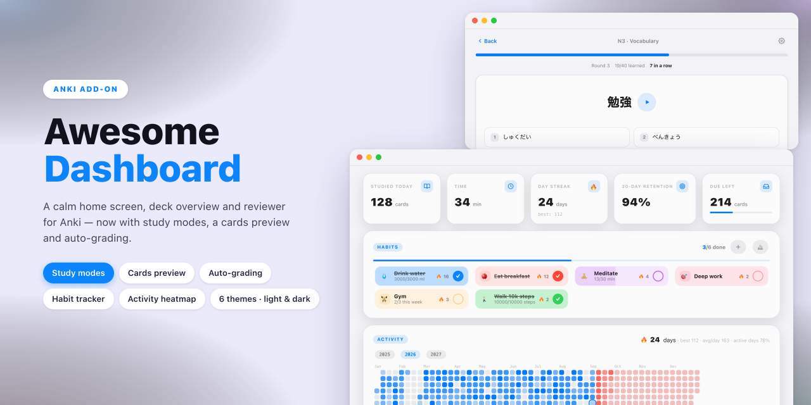

# Awesome Dashboard — for Anki

*[Tiếng Việt](README.vi.md) · **English***

Awesome Dashboard replaces Anki's deck screen, deck overview and review chrome
with a single, consistent interface: stat cards, a GitHub-style activity
heatmap, a Pomodoro timer, exam countdowns and an optional sidebar — across six
colour themes with matching light and dark palettes, in English, Vietnamese and
Japanese.

Requires Anki 23.10 or newer (developed and tested on Anki 26.08).

## Dashboard

A time-of-day greeting, quick actions, stat cards, an activity heatmap you can
browse year by year, and a Pomodoro timer that keeps running while you study.
Exam countdowns sit under the greeting and turn orange inside 14 days.

The sidebar is optional and comes in two widths — full, or a compact icon rail.
While it is shown, the deck list and the header card move into it, with deck
search and a tinted icon per deck.

## Deck overview

Back link, deck icon and description, three count cards, one primary study
button, a **7-day forecast** built from the scheduler's real due dates, the
subdeck list, and quiet footer actions (options, custom study, rename, export,
description). Anki's own bars are hidden here — the page carries its own.

## Review screen

The header (back, deck name, edit, more) and footer (remaining counts, then
Show answer or the four rating buttons) are drawn in the page, so Anki's top
toolbar and answer bar can step aside. Rating intervals come from the
scheduler, so they follow your deck presets and FSRS.

An optional **card skin** rebuilds the answer from the note's fields — reading
above the word, audio button, numbered meanings, image, collapsible example and
notes — with a horizontal flip animation. Click or press Space to flip; rate
with the arrow keys or a mouse swipe and the card flies away.

## Settings

Five pages, laid out like macOS System Settings:

| Page | What's in it |
| --- | --- |
| General | Name, greeting, language, sidebar mode, dashboard sections, Pomodoro lengths |
| Appearance | Theme, light/dark mode, which screens to theme, hiding Anki's native bars |
| Decks | Per-deck card skin, and rename / options / export / delete |
| FSRS | Enable FSRS, desired retention, optimise and evaluate parameters |
| Events | Exam countdown list |

Configuration keys are documented in [config.md](config.md). Prefer the dialog
over editing the JSON directly.

### FSRS

Anki ships the FSRS scheduler natively; this add-on drives it from one place —
global on/off, per-preset desired retention, parameter optimisation and
evaluation, and days since the last optimisation.

### Themes

Six themes (Terracotta, Glass — Apple HIG, Matcha, Aurora, Sunset, Sakura),
each with light and dark palettes — Aurora and Sunset paint their accent as a
gradient — plus a **System / Light / Dark** switch that
changes Anki's own appearance. Switching cross-fades the open page instead of
re-rendering it. Optionally themes Anki's other screens (Add, Browse, Stats,
dialogs) through its CSS variables and the Qt palette.

### Languages

English, Tiếng Việt and 日本語, following Anki's language by default. Every
string lives in `i18n/<code>.json` — copy `en.json`, translate the `strings`
values, and the new language appears in Settings on the next restart. Each file
also carries its own month and weekday names, thousands separator and date
order, so dates read naturally. Missing keys fall back to English, so a partial
translation is fine, and `python3 tools/check_locales.py` reports gaps.

Anki's own screens — its toolbar, Add, Browse, deck options, even the rating
button labels — follow Anki's language, not this setting. So after you pick a
language the add-on offers to switch Anki to it as well and restart. Declining
keeps your current language rather than leaving the two out of step.

## Install

**From AnkiWeb** — in Anki, **Tools → Add-ons → Get Add-ons…**, then paste the
code [`1243176816`](https://ankiweb.net/shared/info/1243176816). Updates arrive
automatically from then on.

**From a file** — download the `.ankiaddon` from the
[latest release](https://github.com/kpdo2910/awesome-dashboard/releases/latest),
then **Tools → Add-ons → Install from file…** and pick it.

Either way, restart Anki afterwards, then open **Tools → Awesome Dashboard
Settings…** (or the ⚙ button on the dashboard).

## Licence

MIT — see [LICENSE](LICENSE).
