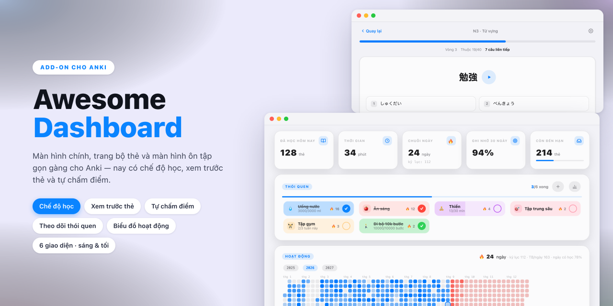

# Awesome Dashboard — cho Anki

***Tiếng Việt** · [English](README.md)*

Awesome Dashboard thay màn hình bộ thẻ, màn hình tổng quan và khung màn ôn thẻ
của Anki bằng một giao diện thống nhất: thẻ thống kê, heatmap hoạt động kiểu
GitHub, đồng hồ Pomodoro, đếm ngược kỳ thi và thanh bên tuỳ chọn — với sáu chủ
đề màu, mỗi chủ đề có bảng màu sáng và tối riêng, hỗ trợ tiếng Việt, tiếng Anh
và tiếng Nhật.

Yêu cầu Anki 23.10 trở lên (phát triển và kiểm thử trên Anki 26.08).

## Bảng điều khiển

Lời chào theo buổi, các nút nhanh, thẻ thống kê, heatmap hoạt động xem được
từng năm một, và đồng hồ Pomodoro vẫn chạy khi bạn đang học. Đếm ngược kỳ thi
nằm ngay dưới lời chào và chuyển màu cam khi còn dưới 14 ngày.

Thanh bên là tuỳ chọn và có hai dạng — đầy đủ hoặc rail icon thu gọn. Khi thanh
bên hiện, danh sách bộ thẻ và phần header chuyển hẳn vào đó, kèm ô tìm bộ thẻ
và icon màu riêng cho từng bộ.

## Màn hình bộ thẻ

Nút quay về, icon và mô tả bộ thẻ, ba thẻ đếm, một nút học chính, **dự báo 7
ngày tới** lấy từ ngày đến hạn thật trong lịch, danh sách bộ thẻ con, và hàng
thao tác mờ ở dưới (tuỳ chọn, học tuỳ biến, đổi tên, xuất, mô tả). Hai thanh
gốc của Anki được ẩn ở màn này vì trang đã tự có.

## Màn ôn thẻ

Thanh trên (quay về, tên bộ thẻ, sửa, thao tác khác) và thanh dưới (số thẻ còn
lại, nút Hiện đáp án hoặc bốn nút chấm điểm) đều nằm trong trang, nên toolbar
và thanh trả lời gốc của Anki có thể lui ra. Mốc thời gian trên nút chấm điểm
lấy từ scheduler nên theo đúng cấu hình bộ thẻ và FSRS.

**Giao diện thẻ** là tuỳ chọn, dựng lại mặt sau từ các trường của note — cách
đọc phía trên từ, nút phát âm thanh, danh sách nghĩa đánh số, hình ảnh, phần ví
dụ và ghi chú thu gọn được — kèm animation lật ngang. Bấm hoặc nhấn Space để
lật; chấm điểm bằng phím mũi tên hoặc vuốt chuột, thẻ sẽ bay đi.

## Cài đặt trong add-on

Năm trang, bố cục theo kiểu macOS System Settings:

| Trang | Nội dung |
| --- | --- |
| Chung | Tên, lời chào, ngôn ngữ, chế độ thanh bên, các khối trên dashboard, độ dài Pomodoro |
| Giao diện | Chủ đề, chế độ sáng/tối, chọn màn hình được áp theme, ẩn thanh gốc của Anki |
| Bộ thẻ | Giao diện thẻ theo từng bộ, và đổi tên / tuỳ chọn / xuất / xoá |
| FSRS | Bật FSRS, mức ghi nhớ mong muốn, tối ưu và đánh giá tham số |
| Sự kiện | Danh sách đếm ngược kỳ thi |

Các khoá cấu hình được mô tả trong [config.md](config.md). Nên chỉnh trong hộp
thoại thay vì sửa JSON trực tiếp.

### FSRS

Anki đã tích hợp sẵn scheduler FSRS; add-on gom mọi thứ về một chỗ — bật/tắt
toàn cục, mức ghi nhớ mong muốn theo từng bộ cấu hình, tối ưu và đánh giá tham
số, cùng số ngày kể từ lần tối ưu gần nhất.

### Chủ đề

Sáu chủ đề (Terracotta, Glass — Apple HIG, Matcha, Aurora, Sunset, Sakura),
mỗi chủ đề có bảng màu sáng và tối — Aurora và Sunset tô màu nhấn bằng chuyển
màu — kèm công tắc **Theo hệ thống / Sáng / Tối**
đổi luôn giao diện của Anki. Khi đổi, trang đang mở sẽ chuyển màu mượt thay vì
vẽ lại. Có thể đồng bộ chủ đề cho các màn hình khác của Anki (Thêm thẻ, Duyệt,
Thống kê, hộp thoại) qua biến CSS và bảng màu Qt.

### Ngôn ngữ

Tiếng Việt, English và 日本語, mặc định theo ngôn ngữ của Anki. Mọi chuỗi nằm
trong `i18n/<mã>.json` — chép `en.json`, dịch phần `strings`, khởi động lại là
ngôn ngữ mới xuất hiện trong Cài đặt. Mỗi file cũng tự mang tên tháng, thứ, dấu
phân cách hàng nghìn và thứ tự ngày tháng riêng nên ngày hiển thị tự nhiên. Key
nào thiếu sẽ tự lùi về tiếng Anh nên dịch dở dang vẫn dùng được. Chạy `python3
tools/check_locales.py` để soát chỗ thiếu.

Các màn hình gốc của Anki — thanh công cụ, Thêm thẻ, Duyệt, tuỳ chọn bộ thẻ,
kể cả nhãn 4 nút chấm điểm — đi theo ngôn ngữ của Anki chứ không theo cài đặt
này. Nên sau khi bạn chọn ngôn ngữ, add-on sẽ hỏi có đổi luôn ngôn ngữ Anki và
khởi động lại không. Nếu từ chối thì ngôn ngữ cũ được giữ nguyên, tránh để hai
bên lệch nhau.

## Cài đặt

**Từ AnkiWeb** — trong Anki, mở **Tools → Add-ons → Get Add-ons…** rồi dán mã
[`1243176816`](https://ankiweb.net/shared/info/1243176816). Các bản cập nhật sau
đó sẽ về tự động.

**Từ file** — tải file `.ankiaddon` ở
[release mới nhất](https://github.com/kpdo2910/awesome-dashboard/releases/latest),
rồi **Tools → Add-ons → Install from file…** và chọn file đó.

Cách nào cũng cần khởi động lại Anki, sau đó mở **Tools → Cài đặt Awesome
Dashboard…** (hoặc nút ⚙ trên bảng điều khiển).

## Giấy phép

MIT — xem [LICENSE](LICENSE).
